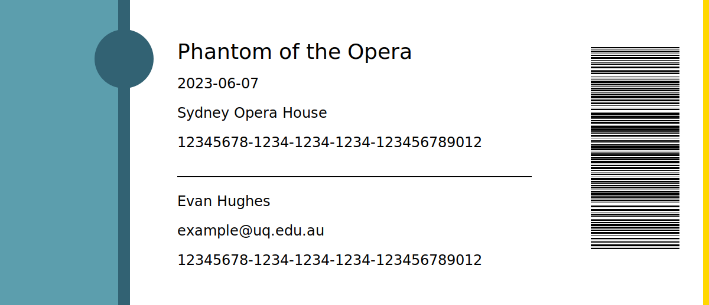
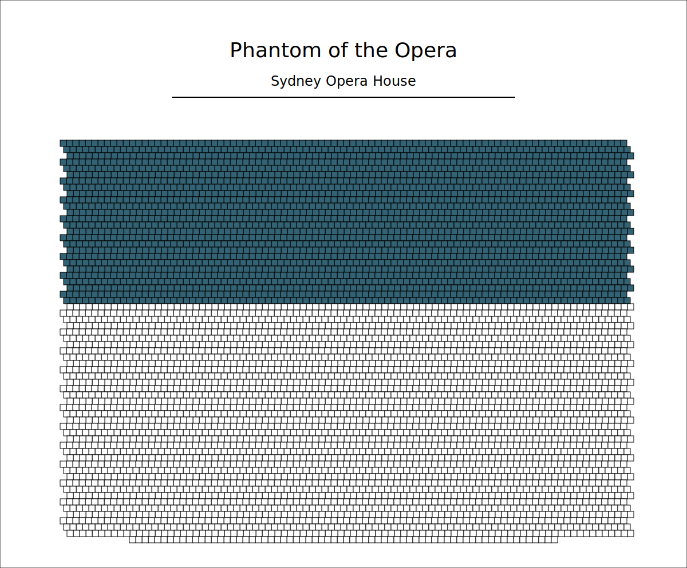

# Hamilton

A command line interface for generating ticket and concert information into rendered SVGs.

## Installation

This package must be installed by collecting the static binary given in the releases.

## Usage

#### Help

```bash
hamilton --help
```


#### Generate a ticket

Tickets are generated from a JSON file like so:

```json
{
  "uuid": "12345678-1234-1234-1234-123456789012",
  "name": "Evan Hughes",
  "email": "example@uq.edu.au",
  "concert": {
    "uuid": "12345678-1234-1234-1234-123456789012",
    "name": "Phantom of the Opera, starring Richard Thomas",
    "date": "2023-06-07",
    "venue": "Sydney Opera House"
  }
}
```

The output is a path with a filename but no extension where a .json will be generated for errors otherwise a svg will be made.

```bash
hamilton generate ticket --input input.json --output output
```

Example:



#### Generate a concert seating plan

Seating plans are generated from a JSON file like so:

```json
{
  "uuid": "12345678-1234-1234-1234-123456789012",
  "name": "Phantom of the Opera, starring Richard Thomas",
  "date": "2023-06-07",
  "venue": "Sydney Opera House",
  "seats": {
    "max": 5738,
    "purchased": 2340
  }
}
```

The output is a path with a filename but no extension where a .json will be generated for errors otherwise a svg will be made.

```bash
hamilton generate concert --input input.json --output output
```

Example:



## Contributing

Contributions are welcome but the project is for the usage in an assessment so some aspects of the program are intentional to create load on the system.
